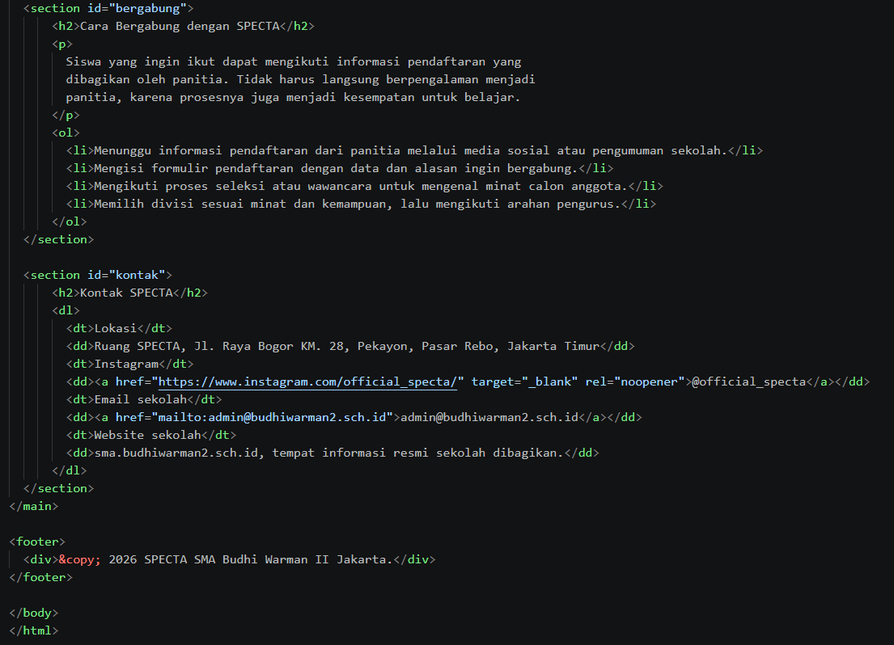
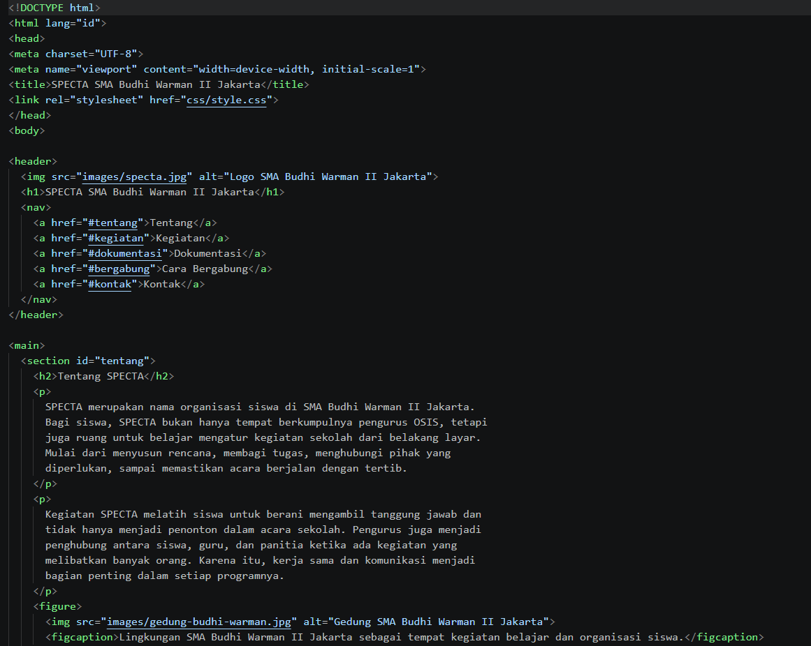
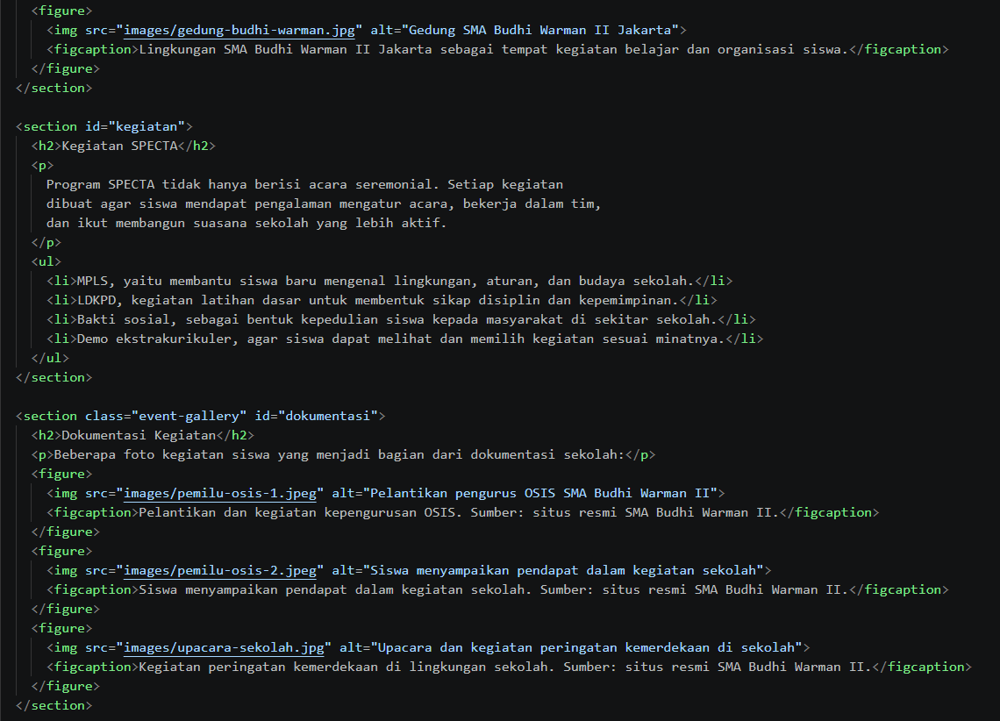

# Laporan Praktikum Web

## Identitas Tugas

- Nama: Farid Zhahir Muttaqin
- NIM: 4525210105
- Tema: Profil organisasi siswa SPECTA
- Sekolah: SMA Budhi Warman II Jakarta

## Judul Program

**SPECTA SMA Budhi Warman II Jakarta**

## Tujuan

Membuat halaman web profil organisasi siswa menggunakan HTML dan CSS eksternal.
Halaman ini berisi informasi tentang SPECTA, kegiatan siswa, dokumentasi event,
cara bergabung, dan kontak sekolah.

## Struktur Folder

```text
tugas/
|-- tugas.html
|-- css/
|   `-- style.css
|-- images/
|   |-- specta.jpg
|   |-- gedung-budhi-warman.jpg
|   |-- pemilu-osis-1.jpeg
|   |-- pemilu-osis-2.jpeg
|   `-- upacara-sekolah.jpg
`-- dokumentasi/
	|-- Readme.md
	|-- Screenshot1.png
	|-- Screenshot2.png
	|-- Screenshot3.png
	`-- Screenshot 4.png
```

## Isi Program

Halaman dibuat dengan beberapa bagian utama:

1. **Tentang SPECTA** menjelaskan peran organisasi siswa dalam membantu kegiatan sekolah.
2. **Kegiatan SPECTA** berisi MPLS, LDKPD, bakti sosial, dan demo ekstrakurikuler.
3. **Dokumentasi Kegiatan** menampilkan foto kegiatan siswa dari dokumentasi sekolah.
4. **Cara Bergabung** menjelaskan langkah pendaftaran anggota SPECTA.
5. **Kontak SPECTA** berisi lokasi, Instagram, email, dan website sekolah.

## Elemen HTML yang Digunakan

- Dua gambar dengan path relatif dan atribut `alt`.
- Link internal menuju bagian Tentang, Kegiatan, Dokumentasi, Cara Bergabung, dan Kontak.
- Link eksternal menuju Instagram SPECTA.
- Link email menggunakan `mailto`.
- Unordered list (`ul`) untuk daftar kegiatan.
- Ordered list (`ol`) untuk langkah bergabung.
- Description list (`dl`) untuk informasi kontak.
- CSS eksternal melalui file `css/style.css`.

## Screenshot Coding







## Screenshot Hasil Running


