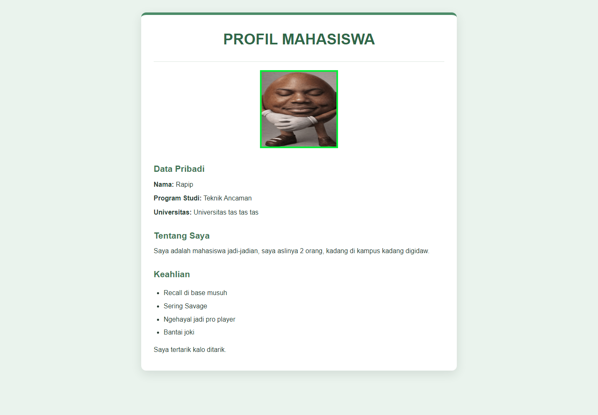
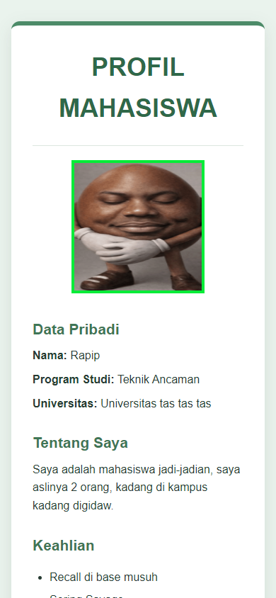
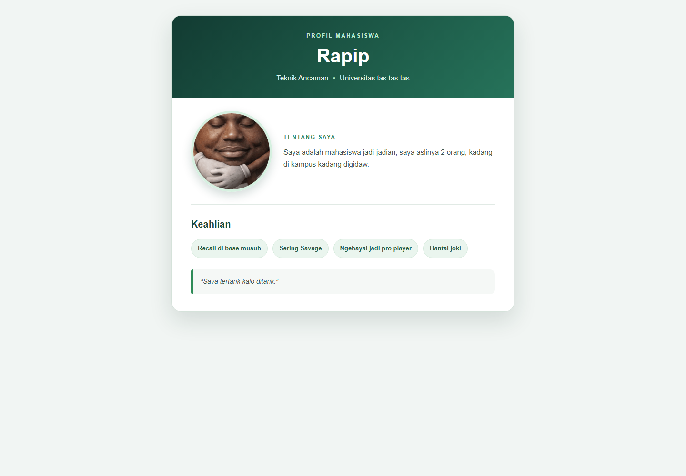
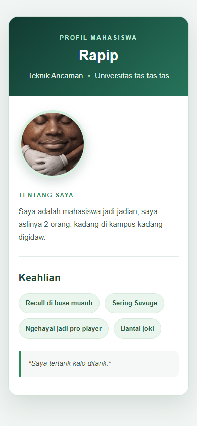

# Modifikasi Profil Mahasiswa — Pertemuan 3

## Studi kasus

Halaman profil Rapip diperbarui agar lebih menarik dan mudah dibaca hanya dengan atribut `style` pada elemen HTML. Tidak ada file CSS terpisah. Informasi profil dan daftar keahlian tetap dipertahankan.

## Dokumentasi sebelum dan sesudah

- **Sebelum:** buka [index-sebelum.html](./index-sebelum.html). Halaman awal memiliki latar hijau muda, foto persegi, judul kapital, dan konten yang ditampilkan sebagai satu kolom sederhana.
- **Sesudah:** buka [index.html](./index.html). Tampilan menggunakan kartu profil dengan header hijau, tipografi dan hierarki informasi yang lebih jelas, foto berbentuk lingkaran, daftar keahlian berupa label, serta kutipan yang diberi penekanan.

### Sebelum — Desktop

### Sebelum — Mobile

### Sesudah — Desktop

### Sesudah — Mobile

